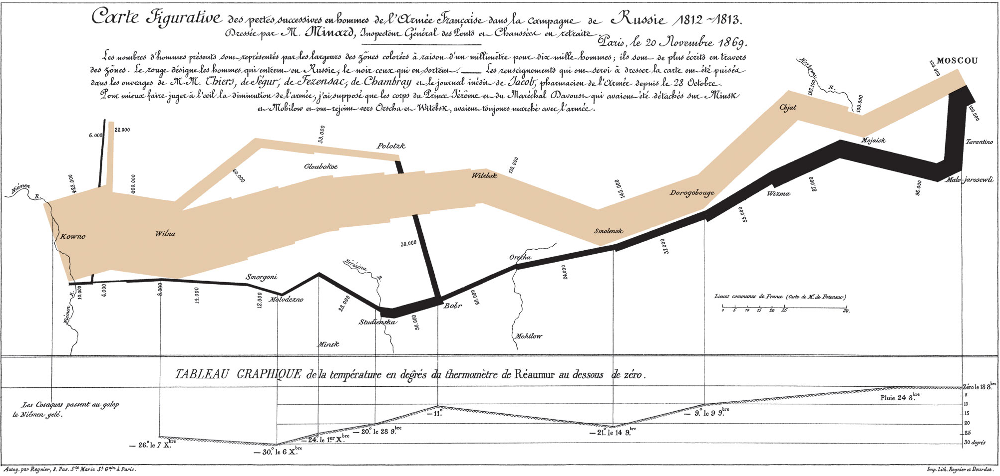
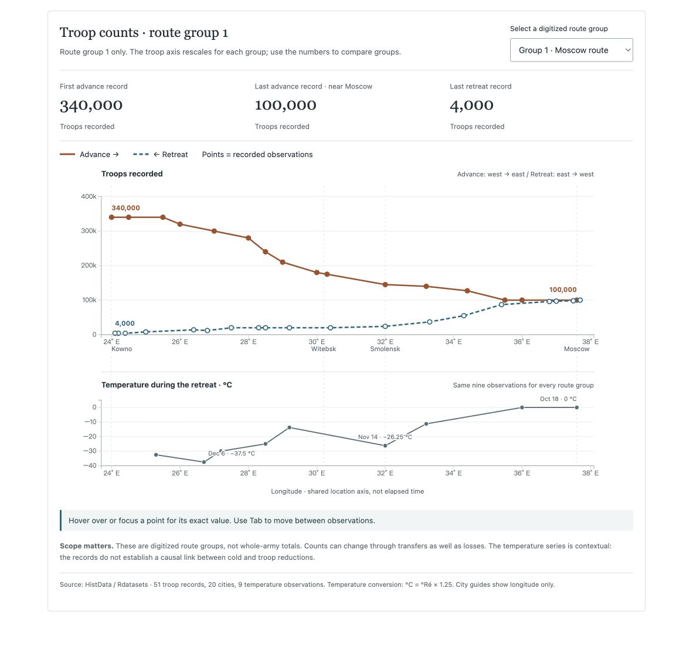

# Visualization Critique and Redesign
## Reading Minard's campaign map
Jiaming Cao · STATS 401 · September 26, 2026

### Original visualization and context
Charles Joseph Minard's 1869 *Carte figurative des pertes successives en hommes de l'armée française dans la campagne de Russie 1812–1813* combines a flow map with a temperature chart [1]. Band width represents troop strength, color distinguishes advance from retreat, and the routes supply geographic context. The main message is the army's contraction during the campaign. I interpret its audience as readers interested in military history, rather than specialists analyzing individual battles. Their tasks are to follow the journey, compare troop strength at different locations, and relate the retreat to recorded temperatures.

For the redesign, I use the HistData transcription distributed through Rdatasets: 51 troop records, 20 city locations, and nine temperature observations [2, 3]. The troop file separates three route groups. Group 1 starts with 340,000 troops; the other groups start with 60,000 and 22,000. Together these reproduce the original map's opening 422,000. My default view shows group 1, not the entire army. The lower panel retains all nine temperature observations.

### Critique
The original has two substantial strengths. First, the shrinking band makes the scale of the contraction immediately visible. Readers can understand the broad result before reading individual labels. Second, the map and temperature panel connect several variables through location. Geographic alignment helps readers relate conditions on the retreat to places along the route.

Three issues become apparent when I use the image on a laptop. First, accurate comparisons require reading rotated numbers or comparing widths at different angles. A band turning through a map has no common baseline. This matters when the task is to compare troop strength at two locations, rather than recognize the overall decline. A separate count axis would support that task more directly.

Second, city names, troop labels, rivers, and intersecting bands compete in a narrow space. The small retreat values are particularly hard to inspect at normal page width. Separating route groups and reducing persistent labels would make the smaller observations easier to retrieve.

Third, the temperature panel uses Réaumur units and abbreviated dates. The journey also changes reading direction: the advance runs eastward, while the retreat is read westward. For a present-day English-speaking student, both conventions add work before comparison can begin. Familiar units, explicit direction labels, and an explanation of the horizontal axis would reduce that work.

### Redesign decisions
I replaced troop-band width with vertical position on a zero-based count axis. Advance and retreat now share a longitude axis, making values at similar longitudes easier to compare. Points mark recorded observations; straight segments connect them without suggesting additional measured records. Solid rust and dashed blue lines distinguish the directions through both color and line style.

I separated route groups with a selector and kept only four city guides. This reduces label collisions while retaining the other groups for inspection. Endpoint labels give immediate values, and hovering or keyboard focus reveals each record's coordinates and troop count. A table offers the same information without requiring interaction with small points. The vertical axis rescales for each group, so a visible note tells readers to compare numerical values across groups.

I converted temperatures to Celsius using °C = °Ré × 1.25 and retained the original units in the details and table. The temperature panel shares the upper panel's longitude scale. Selected dates are written out, and an undated observation remains explicitly undated. Direction labels explain the return journey without reversing the geographic axis.

### Comparison and limitations
The redesign makes exact values and advance–retreat comparisons easier to inspect. For example, group 1 records 145,000 troops at 32° E during the advance and 24,000 during the retreat. These are observations from different stages, not simultaneous counts. The original remains better at conveying the physical route and the campaign's overall shape: my chart removes latitude from the visual encoding.

The transcription is also a simplified representation, not a ledger of deaths or transfers. Route groups must not be added at arbitrary longitudes, and a declining count cannot be interpreted directly as mortality. Temperature and troop observations do not share exact dates. Their alignment supports geographic comparison, but does not establish that cold caused a particular reduction in troops.

### Figures

Figure 1. Minard's original 1869 map. Public domain; Wikimedia Commons [1].

Figure 2. D3 redesign in its default state. Troop counts refer to route group 1; the lower panel shows the nine retreat temperature observations.

### References
1. Minard, C. J. (1869). *Carte figurative des pertes successives en hommes de l'armée française dans la campagne de Russie 1812–1813*. Original image and caption, Wikimedia Commons. https://commons.wikimedia.org/wiki/File:Minard.png
2. Friendly, M., et al. *HistData: Minard*. Dataset documentation. https://friendly.github.io/HistData/reference/Minard.html
3. Arel-Bundock, V. *Rdatasets*, HistData CSV distribution: [troops](https://vincentarelbundock.github.io/Rdatasets/csv/HistData/Minard.troops.csv), [temperatures](https://vincentarelbundock.github.io/Rdatasets/csv/HistData/Minard.temp.csv), and [cities](https://vincentarelbundock.github.io/Rdatasets/csv/HistData/Minard.cities.csv). Accessed September 26, 2026.
